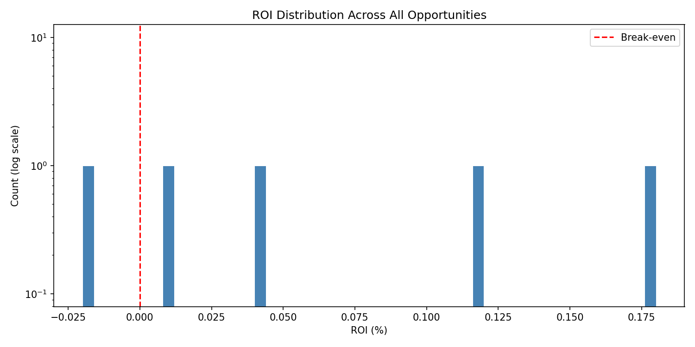

# Arb Scanner

[](https://github.com/ianfigueroa/Arb-Scanner/actions/workflows/ci.yml)
[](LICENSE)

A read-only arbitrage scanner that watches DEX pools across multiple chains and logs when it spots a price discrepancy worth noting. It does not execute anything: no private keys, no transactions, no bundles. It is a research and monitoring tool for on-chain pricing, not a trading engine.

---

## What it does

Every block, it runs triangular arb paths through pools on each chain you've configured and checks if selling WETH → stable → stable → WETH comes back with more than you started with after gas. When it finds one, it logs it and writes it to a local SQLite database. It also watches the WETH price across all active chains and alerts you if they drift apart by more than a configurable threshold.

**Chains:** Ethereum, Arbitrum, Base, Polygon (any combination — just add the URLs)

**DEXes:**
- Ethereum: Uniswap V2, Uniswap V3 (0.05% and 0.3% pools)
- Arbitrum: SushiSwap V2
- Base: BaseSwap V2
- Polygon: QuickSwap V2

**Input sizes scanned per path:** 0.1, 0.5, 1, 5, 10 ETH

**Pool addresses** — Ethereum and Arbitrum use verified static addresses. Base (BaseSwap) and Polygon (QuickSwap) query their V2 factory contracts at startup via `getPair(tokenA, tokenB)` to derive the canonical pool address at runtime. This avoids stale hardcoded addresses failing token verification on startup.

---

## Setup

### 1. Get free RPC keys from Alchemy

Go to [alchemy.com](https://www.alchemy.com), make a free account, and create apps for whichever chains you want to run. Each app gives you a WebSocket URL that looks like:

```
wss://eth-mainnet.g.alchemy.com/v2/YOUR_KEY
```

You only need the chains you care about. If you just want Ethereum, one key is enough.

### 2. Configure

```bash
cp .env.example .env
```

Then open `.env` and paste in your URLs:

```
ETH_WS_URL=wss://eth-mainnet.g.alchemy.com/v2/abc123
ARBITRUM_WS_URL=wss://arb-mainnet.g.alchemy.com/v2/abc123
BASE_WS_URL=wss://base-mainnet.g.alchemy.com/v2/abc123
POLYGON_WS_URL=wss://polygon-mainnet.g.alchemy.com/v2/abc123

CROSS_CHAIN_THRESHOLD_PCT=0.1
```

Any chain without a URL is skipped automatically — you don't need all four.

### 3. Run

```bash
cargo run
```

Hit **Ctrl+C** to stop and print a session summary.

---

## Reading the logs

**Startup** — verifies pool token ordering on-chain and loads initial reserves:
```
INFO pool token orderings verified  chain=ethereum
INFO reserves bootstrapped          chain=ethereum
INFO subscribed to pool events      chain=ethereum
```

**Every block** — one line per chain with current WETH price and gas:
```
INFO chain=ethereum block=21000000 gas_gwei="12.34" WETH: $3412.50
INFO chain=arbitrum block=21000001 gas_gwei="0.11"  WETH: $3415.20
```

**Opportunity found:**
```
INFO [OPPORTUNITY] chain=ethereum path="WETH→USDC→DAI→WETH" roi_pct="0.0023" gas_cost_usd="1.40"
```

**Cross-chain price spread alert:**
```
WARN [CROSS-CHAIN ALERT] spread="0.42%" ethereum=$3412.50 arbitrum=$3426.90
```

**Session summary on exit:**
```
=== Session Summary ===
Blocks scanned:       312
Opportunities found:  7
Best opportunity:
  Chain:              ethereum
  Path:               WETH→USDC→DAI→WETH V3-500
  Input:              1.0000 ETH
  ROI:                0.0031%
  Gas cost:           $1.52
Runtime:              3721.4s
======================

=== Research Summary ===
Top paths by frequency:
  1.  WETH→USDC→DAI→WETH     42 hits
  2.  WETH→DAI→USDC→WETH     31 hits

Top paths by avg ROI:
  1.  WETH→USDC→DAI→WETH     0.0023%

Exported: arb_opportunities_1741400000.csv
========================
```

All sessions write to `arb_opportunities.db` (SQLite, created automatically). On exit it prints the top paths by count and ROI and exports a CSV with every opportunity found.

**Analyze the data:**
```bash
pip install -r analysis/requirements.txt
python analysis/analyze.py arb_opportunities.db
```

This prints rich summary tables and saves 5 charts to `analysis/output/`:
- `roi_distribution.png` — histogram of ROI across all opportunities
- `opportunities_timeline.png` — opportunities per hour, per chain
- `path_frequency.png` — top 15 paths by hit count
- `gas_vs_profit.png` — scatter of gas cost vs net profit
- `weth_price.png` — WETH/USD price over time per chain

Example chart from a sample run:



---

## Honest caveats

**The numbers are estimates, not guarantees.** The V3 quote uses marginal price (sqrtPriceX96) which ignores price impact. V2 uses the constant-product formula which is more accurate but still doesn't account for other transactions in the same block changing the reserves before yours lands.

**Seeing an opportunity doesn't mean you can capture it.** MEV searchers are doing the same math faster, with better tooling, and submitting bundles directly to validators. A positive `roi_pct` is a signal worth watching, not a confirmed profit.

**This is read-only.** No signing key, no transaction builder, no execution.

**ethers-rs 2.x is in maintenance mode.** Works fine for this use case. If you want to build on top of this seriously, migrating to [alloy-rs](https://github.com/alloy-rs/alloy) is the right call.

---

## Architecture

```
src/
├── main.rs              entry point, spawns one task per chain + cross-chain monitor
├── types.rs             ChainId, DexType, PoolKey, PoolState, ArbPath, HopSpec
├── pools.rs             PoolRegistry, factory resolution, on-chain verify, bootstrap, subscriptions
├── arb.rs               path execution, gas estimation, scan loop
├── cross_chain.rs       spread calculation, WARN alert task
├── db.rs                SQLite persistence (opportunities + price snapshots, CSV export)
├── config/
│   ├── mod.rs           pool_catalog(), arb_paths(), weth_usdc_from_catalog()
│   ├── ethereum.rs      V2 + V3 pools, 8 arb paths (static addresses, verified)
│   ├── arbitrum.rs      SushiSwap V2 pool (price monitor only)
│   ├── base.rs          BaseSwap V2 pools + factory address
│   └── polygon.rs       QuickSwap V2 pools + factory address
└── dex/
    ├── mod.rs           synchronous quote dispatch
    ├── v2.rs            constant-product AMM formula
    ├── v3.rs            sqrtPriceX96 approximate quote
    └── curve.rs         async get_dy (not wired into scan paths yet)

analysis/
├── analyze.py           rich tables + 5 matplotlib charts from arb_opportunities.db
└── requirements.txt     pandas, matplotlib, seaborn, rich
```

**What `pools.rs` does at startup for each chain:**

1. For Ethereum and Arbitrum — reads static pool addresses from `config/` (already verified against mainnet)
2. For Base and Polygon — calls `factory.getPair(tokenA, tokenB)` on-chain for each pool pair, gets the canonical address back from the factory, then builds the pool catalog with those real addresses
3. For every chain — calls `token0()` and `token1()` on each pool address to confirm the expected tokens are there. If anything is wrong, that chain fails to start with a clear error rather than silently scanning wrong pools.

---

## Tests

```bash
cargo fmt --check
cargo clippy --all-targets --all-features -- -D warnings
cargo test
python -m unittest analysis.test_analyze
```

Verified locally: 83 Rust tests and 3 Python tests covering AMM math, V3 fixed-point arithmetic, freshness guards, cross-chain spread logic, config invariants, dispatch routing, the SQLite DB layer, and analysis schema handling.
