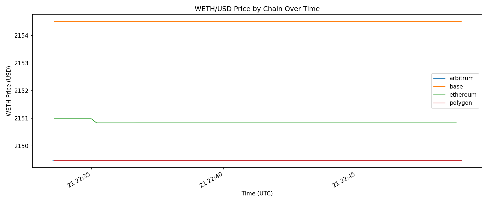

# Arb Scanner

[](https://github.com/ianfigueroa/Arb-Scanner/actions/workflows/ci.yml)
[](LICENSE)

This is a read-only arbitrage scanner I built to watch DEX pricing across a few chains and log anything interesting. It does not execute trades, hold keys, build bundles, or try to act like a production MEV bot. The point is to monitor prices, test path logic, and keep the results in a local database I can inspect later.

## What It Does

Every block, the scanner checks a small set of triangular paths like `WETH -> USDC -> DAI -> WETH` on each enabled chain. If the estimated round trip is positive after gas, it logs the opportunity and stores it in SQLite. It also records WETH/USD reference prices per block and warns when those prices drift too far apart across chains.

Supported chains:
- Ethereum
- Arbitrum
- Base
- Polygon

Supported venues:
- Ethereum: Uniswap V2, Uniswap V3 0.05%, Uniswap V3 0.3%, Curve 3pool for pricing context
- Arbitrum: SushiSwap V2
- Base: BaseSwap V2
- Polygon: QuickSwap V2

Input sizes scanned per path:
- `0.1`
- `0.5`
- `1`
- `5`
- `10` ETH

How pool addresses are handled:
- Ethereum and Arbitrum use verified static pool addresses.
- Base and Polygon resolve V2 pair addresses from their factory contracts at startup so the scanner uses canonical live pool addresses instead of stale hardcoded values.

## Quick Start

### 1. Copy the environment file

```bash
cp .env.example .env
```

### 2. Add at least one WebSocket RPC URL

Example:

```dotenv
ETH_WS_URL=wss://eth-mainnet.g.alchemy.com/v2/your_key
ARBITRUM_WS_URL=wss://arb-mainnet.g.alchemy.com/v2/your_key
BASE_WS_URL=wss://base-mainnet.g.alchemy.com/v2/your_key
POLYGON_WS_URL=wss://polygon-mainnet.g.alchemy.com/v2/your_key

CROSS_CHAIN_THRESHOLD_PCT=0.1
ARB_DB_PATH=arb_opportunities.db
```

Any chain without a URL is skipped automatically.

### 3. Run the scanner

```bash
cargo run
```

Stop it with `Ctrl+C`.

### 4. Analyze the latest session

```bash
pip install -r analysis/requirements.txt
python analysis/analyze.py arb_opportunities.db
```

By default, the analysis script looks at the latest recorded session and writes charts into `analysis/output/<session_id>/`.

## Reading The Logs

Startup example:

```text
INFO arb_bot: database opened path="arb_opportunities.db"
INFO arb_bot: session started session_id="session-1761332485123" active_chains="ethereum,arbitrum,base,polygon"
INFO arb_bot: pool catalog resolved chain="ethereum" pools=8
INFO arb_bot: reserves bootstrapped chain="ethereum"
INFO arb_bot::pools: subscribed to pool events chain="ethereum"
```

Per-block example:

```text
INFO arb_bot: WETH: $2150.50 chain="ethereum" block=24708245 gas_gwei="0.04"
INFO arb_bot: WETH: $2149.38 chain="arbitrum" block=444231730 gas_gwei="0.02"
```

Cross-chain alert example:

```text
WARN arb_bot::cross_chain: [CROSS-CHAIN ALERT] ethereum=$2150.50 arbitrum=$2149.38 base=$2154.28 spread="0.2281%"
```

Recovery warning example:

```text
WARN arb_bot: recovered stale sessions from an unclean shutdown recovered_sessions=1 recovered_at=1774140134
```

Illustrative opportunity log:

```text
INFO arb_bot: [OPPORTUNITY] chain="ethereum" path="WETH→USDC→DAI→WETH" roi_pct="0.0023" gas_cost_usd="1.40"
```

Illustrative shutdown summary when a session finds profitable opportunities:

```text
=== Session Summary ===
Session ID:           session-1761332485123
Blocks scanned:       312
Opportunities found:  7
Best opportunity:
  Chain:                ethereum
  Path:                 WETH→USDC→DAI→WETH
  Input:                1.0000 ETH
  Estimated net (wei):  1234567890000000
  ROI:                  0.0031%
  Gas cost:             $1.52
Runtime:              3721.4s
======================
```

All runs write into `ARB_DB_PATH`, which defaults to `arb_opportunities.db`. The database is session-aware:
- each scanner start creates a `sessions` row
- `opportunities` rows are tagged with `session_id`
- `price_snapshots` rows are tagged with `session_id`
- if the previous run ended uncleanly, the next startup marks those stale sessions as `recovered`

## Session-Based Analysis

Analyze the latest session:

```bash
python analysis/analyze.py arb_opportunities.db
```

Analyze one specific session:

```bash
python analysis/analyze.py arb_opportunities.db --session session-1761332485123
```

List available sessions:

```bash
python analysis/analyze.py arb_opportunities.db --list-sessions
```

`--list-sessions` shows the session status so it is easy to tell the difference between active, completed, and recovered runs.

Analyze the full historical database instead of one session:

```bash
python analysis/analyze.py arb_opportunities.db --all
```

Output locations:
- latest or explicit session: `analysis/output/<session_id>/`
- aggregate mode: `analysis/output/all/`

Charts produced:
- `roi_distribution.png`
- `opportunities_timeline.png`
- `path_frequency.png`
- `gas_vs_profit.png`
- `weth_price.png`

`weth_price.png` is the chart that should line up most closely with the live block logs, because both come from the same `price_snapshots` data.

Real chart from a live session I ran on 2026-03-21:



That image came from a real 15-minute run of the scanner. It recorded `4708` price snapshots across Ethereum, Arbitrum, Base, and Polygon, but it still found `0` profitable opportunities. Because of that, the price chart is the only analysis image from that run that is actually informative. The other four analysis images are still generated, but they only become useful once a session records real opportunities.

## Architecture

High-level component notes live in [docs/architecture.md](docs/architecture.md).

Code layout:

```text
src/
├── main.rs
├── types.rs
├── pools.rs
├── arb.rs
├── cross_chain.rs
├── db.rs
├── config/
└── dex/

analysis/
├── analyze.py
├── requirements.txt
└── test_analyze.py
```

## Design Tradeoffs

- The scanner is read-only on purpose. That keeps the scope honest and avoids key-management and execution risk.
- SQLite is good enough for this kind of local research workflow and easy to inspect by hand.
- Pool coverage is curated, not exhaustive. That keeps the startup path manageable, but it is not a full market search surface.
- The Uniswap V3 quote uses marginal price from `sqrtPriceX96`, which is useful for monitoring but not a full execution model.
- Curve quotes call the pool's on-chain `get_dy` rather than reimplementing the stableswap math locally, so a quote is only as current as the RPC response.
- The Python analysis layer is separate from the Rust runtime so I can change reporting without touching the scanner itself.

## Known Limitations

- Positive ROI in the logs is an estimate, not guaranteed executable profit.
- The scanner does not submit transactions or compete with real searchers.
- V3 quotes do not model full price impact across liquidity ranges.
- Sessions are stored in one SQLite file, which is convenient locally but not a great long-term format for higher-volume research.
- Observability is still pretty simple: logs and SQLite, no metrics backend or external alerting yet.
- The committed live verification data currently demonstrates pricing, spread detection, persistence, and chart generation. It does not yet include a stored profitable opportunity session.

## Roadmap

- Add explicit session filtering and comparison views to the Python charts.
- Add better observability, including structured metrics and richer stale-pool diagnostics.
- Expand path coverage and improve quote accuracy for deeper research runs.
- Evaluate an `alloy-rs` migration if the runtime grows beyond the current `ethers-rs` footprint.
- Publish GitHub release pages for future tags and keep the release notes aligned with the latest live verification run.

## Tests

```bash
cargo fmt --check
cargo clippy --all-targets --all-features -- -D warnings
cargo test
python -m unittest analysis.test_analyze
```

Verified locally:
- `cargo test`: 90 passing tests
- `python -m unittest analysis.test_analyze`: 8 passing tests

Latest smoke verification:
- ran the scanner against an isolated temp DB using `ARB_DB_PATH`
- forced an unclean stop, restarted it, and confirmed the first session was marked `recovered`
- latest DB prices matched the live logs on restart:
  - Ethereum: `2087.32`
  - Arbitrum: `2088.25`
  - Base: `2089.14`
  - Polygon: `2086.24`
