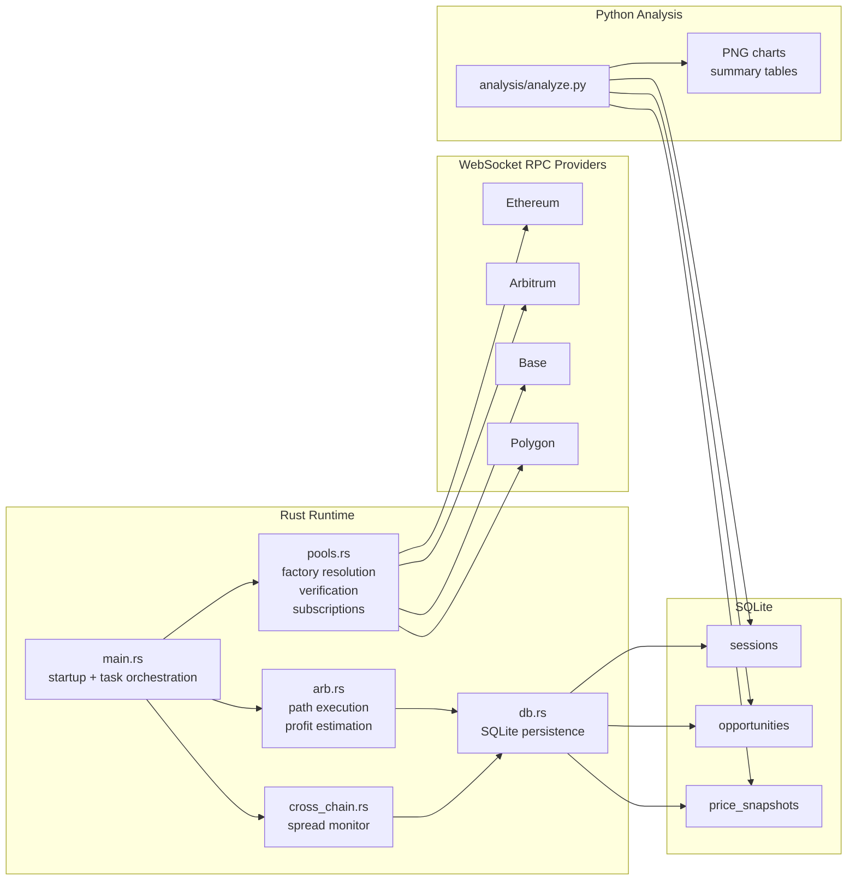

# Architecture

`Arb Scanner` is split into a live Rust runtime and a post-run Python analysis layer.

## Runtime Responsibilities

- `main.rs` loads configuration, creates a new session record, starts one chain task per enabled WebSocket RPC, and prints the session summary on shutdown.
- `pools.rs` resolves pools, verifies token ordering, bootstraps reserve state, subscribes to pool events, and refreshes stale pools.
- `arb.rs` runs the configured triangular paths and estimates profitability after gas.
- `cross_chain.rs` compares per-chain WETH prices and emits spread alerts.
- `db.rs` stores session metadata, profitable opportunities, and price snapshots in SQLite.

## Data Model

- `sessions`: one row per scanner run with `session_id`, `started_at`, `ended_at`, active chains, and the configured cross-chain alert threshold.
- `opportunities`: profitable opportunities only, tagged with `session_id`.
- `price_snapshots`: block-level WETH reference prices, tagged with `session_id`.

Legacy databases are migrated in place. Older rows are backfilled into a synthetic `legacy` session so the data remains analyzable.

## Analysis Responsibilities

- `analysis/analyze.py` reads one session by default.
- `--session <id>` selects an explicit session.
- `--all` analyzes the full database.
- `--list-sessions` prints available sessions and exits.

Charts are written into `analysis/output/<scope>/`, where scope is either a real `session_id` or `all`.
